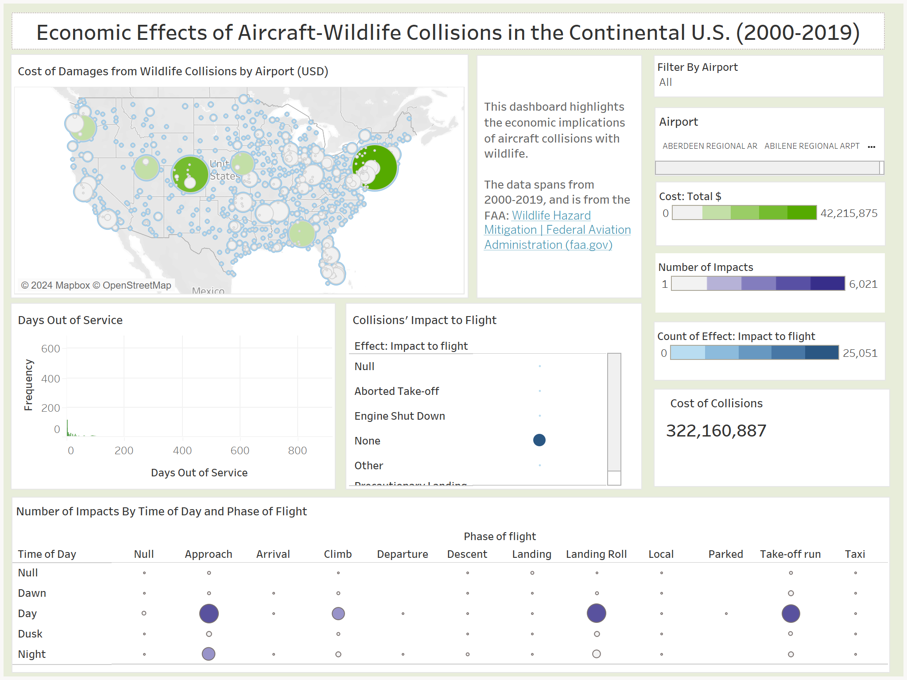
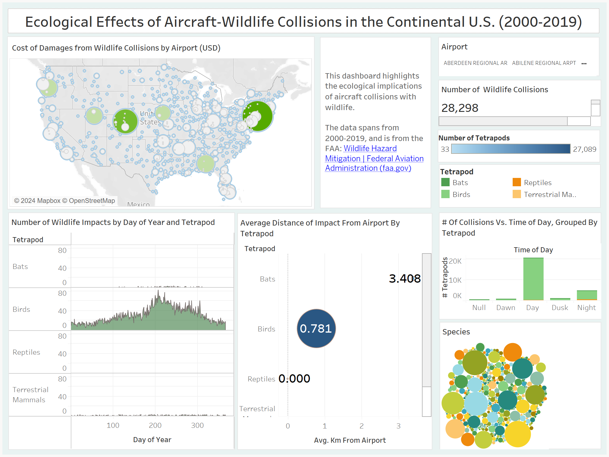

# An Analysis of Aircraft-Wildlife Strikes in the Continental U.S., 2000-2019

#### By Brigitte Yan, April 23, 2024
## Introduction

This project aims to gain insights into wildlife-aviation collisions by analyzing data from the Federal Aviation Administration for the Continental U.S., between 2000-2019.

The data can be broadly grouped by three themes: type of animal hit, consequences to the airline and the time and place of collision. 

The main tool of analysis is Tableau, which was used to create various interactive graphs and dashboards. 

## Data Sources

[FAA collisions dataset, courtesy of Lighthouse Labs](https://docs.google.com/spreadsheets/d/1V-tOmmtGtiY_3XMnYtVblDhlj_kzLBxa/edit?rtpof=true&sd=true.#gid=1639910750)

[Project Outline, courtesy of Lighthouse Labs](https://github.com/lighthouse-labs/Final-Project-Tableau)

[Airport codes with their corresponding latitude and longitude](https://github.com/ip2location/ip2location-iata-icao)

## Dashboard 1:
### [Interactive dashboard 1](https://public.tableau.com/views/FAA_wildlife_collisions/economics_dashboard?:language=en-US&publish=yes&:sid=&:display_count=n&:origin=viz_share_link)
 

This dashboard explores the economic consequences of wildlife collisions, focusing on cost, days out of service, and flight impact. By clicking on bubbles on the map, users can view the impacts specific to the selected airport.

**Some notable findings:**
- La Guardia in NY has highest number of wildlife collisions
- The total cost of collisions is $322,000,000+
- Most collisions occur during landing, approach and take-off
- Most collisons occur either during the day or at night 

## Dashboard 2:
### [Interactive dashboard 2](https://public.tableau.com/views/FAA_wildlife_collisions/ecology_dashboard?:language=en-US&publish=yes&:sid=&:display_count=n&:origin=viz_share_link)

This dashboard delves into the ecological repercussions of aircraft-wildlife collisions, showcasing the distribution of impacts across tetrapod species, collision occurrences by date and time of day relative to tetrapods, and the average distance of impacts from airports categorized by tetrapods.

**Some notable findings:**
- A large majority of collisions are with birds
- Bats collide with aircraft farthest from airports, at an average of 3.4km away
- Terrestrial mammals collide with aircraft closest to airports, at an average of 0.004km away
- Terrestrial mammals are most likely to be hit at night, while birds are most likely to be hit during the day 